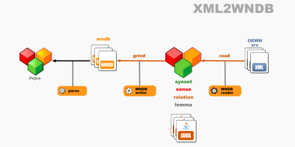
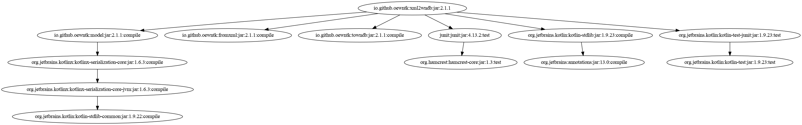

# Open English Wordnet XML-to-WNDB grinder

This library reads a model from XML files and writes it to WNDB format.

Project [grind_xml2wndb](https://github.com/oewntk/grind_xml2wndb)

See also [model](https://github.com/oewntk/model/blob/master/README.md).

See also [fromxml](https://github.com/oewntk/fromxml/blob/master/README.md).

See also [towndb](https://github.com/oewntk/towndb/blob/master/README.md).

See also [oewntk](https://github.com/oewntk) and [globalwordnet/english-wordnet](https://github.com/globalwordnet/english-wordnet).

## Dataflow

This library reads from XML files and other XML files that contain extra data.

This output conforms to the **WNDB** standards.

## Command line

`grind.sh [XML] [XML2] [WNDB]`

grinds the WNDB database

*where*

[XML] OEWN distribution XML merged file

[XML2] directory where extra XML extra files are

[WNDB3] directory where WNDB files are output

## Maven Central

		<groupId>io.github.oewntk</groupId>
		<artifactId>xml2wndb</artifactId>
		<version>1.0.0-SNAPSHOT</version>

## Dependencies

